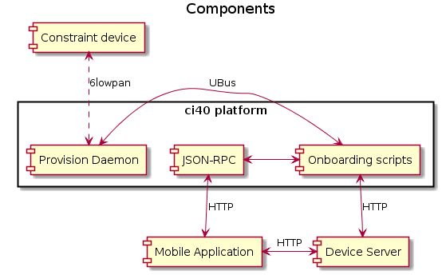
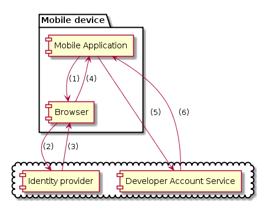
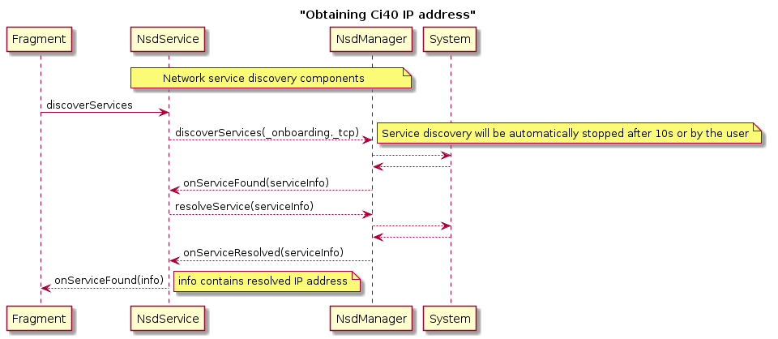
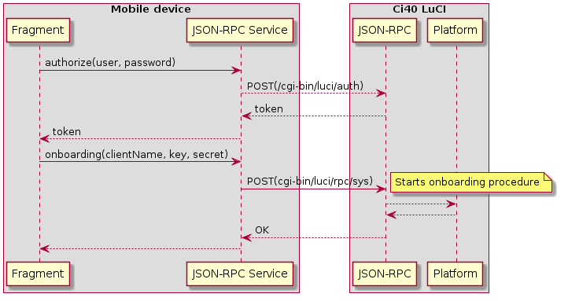

# Ci40 Provisioning and Onboarding Application for Android

---

# Prerequisites
 After importing project to Android Studio please rename 'app/gradle.properties.sample'
 to 'app/gradle.properties' and provide proper configuration to sign your app.

# About the application

 The 'Onboarding-app' is a mobile Android application that helps users to 
 easily perform Ci40 onboarding and clickers provisioning. This gets Ci40 and constrained devices onto a network and registered with Device Server.
 
 This Android application is one component within a bigger system consisting of Ci40 tooling (provisioning demon & scripts),
 constrained devices (running provisioning library) and Device Server (DS)
 as illustrated in the following diagram:
  
  
 
 What this means is that using a secure communication channel, the mobile client is able to prepare Ci40 and constrained devices to interact with the Device Server.
 
## Android onboarding application responsibilities
 
 For Ci40, the mobile application must:

  * provide the configuration necessary to download and store certificates from Device Server,    
  * introduce Ci40 with a user-friendly client name (the board will be visible on the developer console with that name), 
  * provide configuration for the Awa client
  
  This is known as the "Ci40 onboarding process".
  
  For constrained devices the "provisioning process" requires the mobile client to:
   
  * provide network configuration
  * provide configuration to obtain a PSK from the Device Server   
  

## Other component responsibilities
 
 These components are all required by the system as a whole, and gaining some understanding of them will help to clarify the role of the mobile application.

 * provisioning demon:
    - application that runs on Ci40 board,
    - ensures secure connection between constrained devices,
    - exchanges crypto keys and much more
    - can be found [here] (https://github.com/CreatorDev/ci40-provision-daemon)
 
 * scripts:
    - provides entry point for communication provisioning demon and LuCI web scripts
    - exposes utility API available via JSON-RPC and uBus
    - can be found [here] (https://github.com/CreatorDev/ci40-onboarding-scripts)
 
 * provisioning library:
    - delivers PSK and other configuration data to provision constrained devices
    - can be found [here](https://github.com/CreatorDev/contiki-provisioning-library) 
 
 * device server:
    - LWM2M management server,
    - exposes secured REST API/HTTPs used by the mobile app
 
## Communication with Device Server via REST API
 
 Communication with Device Server requires authentication with a user account.
 To acquire access keys (that will be used to obtain a Device Server access token),
 the user has to login first with their CreatorID (points (1)-(4) on the following diagram).
 Having 'token_id' from the Identity Provider (IP) client now may obtain access keys (key and secret)
 performing simple HTTP request (points (5) and (6)) to the 'Developer Account Service.

 

 (1) launch system browser for signing into identity provider
 
 (2) login/sign-up using system browser
 
 (3) Identity Provider (IDP) issues an authorization code to the redirect URI
 
 (4) application receives authorization intent with token_id
 
 (5) - (6) requesting access keys
  
 Having access keys we can easily login to Device Server and request for 
 a list of connected clients.
    
# Onboarding

## Dependencies
  
 To run properly following list of dependencies must installed on Ci40:
    
 ```curl luci-mod-rpc libubox-lua avahi luci-ssl uhttpd-mod-tls```
 
## Prerequisites
 - Developer has account on the Device Server (you can make one on the [Developer Console](http://console.creatordev.io))
 - Ci40 has configured network connection
 - Ci40 is running mDNS, 
 - mDNS responds to search _onboarding._tcp service type

## Resolving Ci40 IP address
 
 The mobile application is designed to work in the local area network. To obtain 
 the Ci40 IP address the mobile client uses Multicast DNS service discovery.
 the following diagram shows this procedure: 
 
  
 
## Ci40 configuration
  
 The mobile client can now send configuration data
 to the Ci40. This can be achieved via LuCI through JSON-RPC API. 
 The following sequence diagram shows this procedure. 
 
 
  
 If the 'onboarding' operation succeeds a new device should be visible on the 
 Developer Console and on the clients list in the application.
 
## RPC API
  Authorization and onboarding are two remote procedures that can be executed.
  In addition to these there are other methods that can:
  - remove configuration
  - get basic info about LuCI configuration
  - check if Ci40 is configured
  
# Constrained device provisioning
  
  To be done...
  